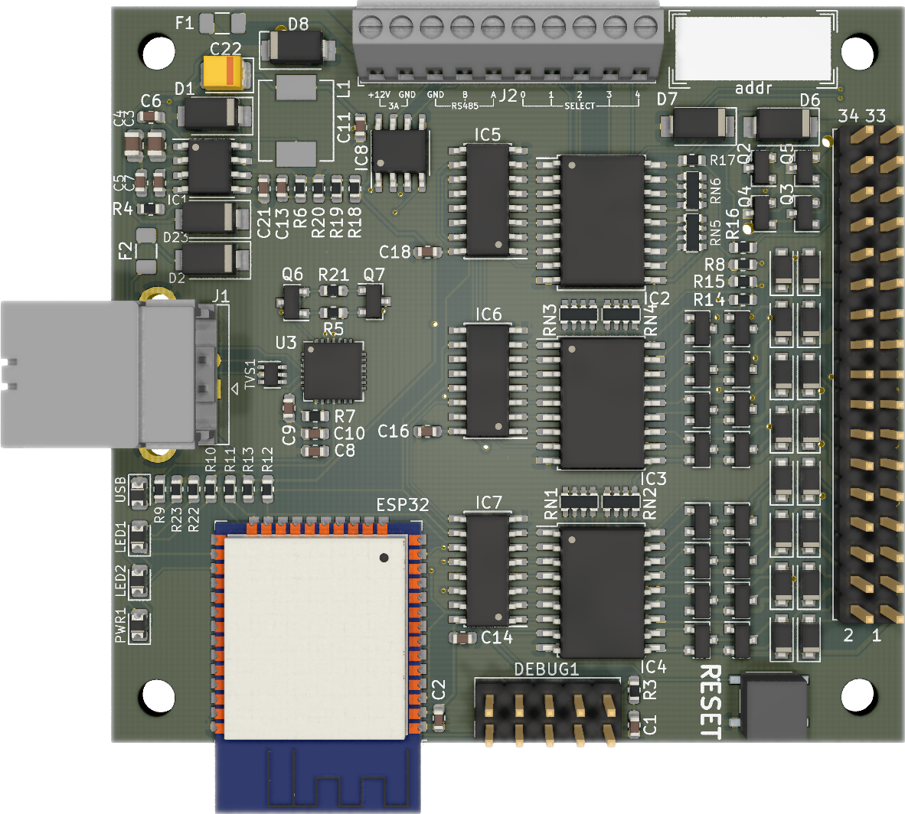

# Fluepdot
   

**Fluepdot** is a hardware and C project for controlling flip disc panels which where in use by the Berlin public transport operator **[BVG](https://www.bvg.de/en)**.

> This project was shown at [36C3](https://events.ccc.de/congress/2019/wiki/index.php/Main_Page). A large display was constructed from many flipdots. [Pictures](https://www.deutschlandfunkkultur.de/chaos-communication-congress-in-leipzig-auf-den-spuren-von.1264.de.html?dram:article_id=466775) [of](https://foto.benedikt-geyer.de/fluepdot-36c3/) [the](https://www.korrupt.biz/7204/36c3-nachtraege/) [installation](https://www.astrastudio.de/cloud/index.php/apps/gallery/s/nDda9j8dZQ2oNMy#IMG_7059.jpeg).

## Documentation
For **documentation** and a **getting started**, please head over to [https://fluepdot.readthedocs.io/en/latest/](https://fluepdot.readthedocs.io/en/latest/).

## Hardware

Flipdots and required HW  can be purchased by contacting [fluepdot-sales@luepke.email](mailto:fluepdot-sales@luepke.email).

## Firmware
You can download the latest standalone firmware installer [here](https://gitlab.com/fluepke/fluepdot/-/jobs/artifacts/master/raw/software/service_utility/service_utility?job=build_service_utility).

## License
Copyright (c) 2020, [@fluepke](http://twitter.com/fluepke) (Fabian Luepke)

Distributed under the terms of the GNU Affero General Public License version 3.

The full license is in the file LICENSE, distributed with this software.
