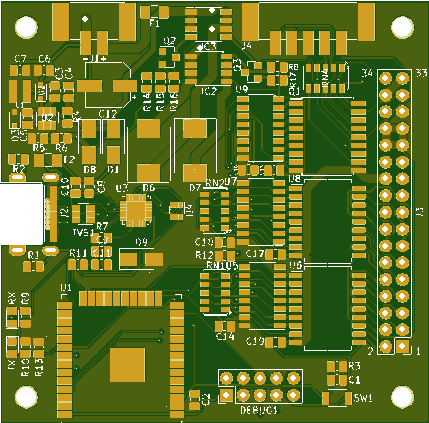

# Fluepdot
> **Beware**: This is a work in progress. PCBs are known to contain bugs(!), but however - are still working. Please see [issues](https://gitlab.com/fluepke/fluepdot/issues)


Project for having fun with Annax flipdot displays.

## Overview
The [Berliner Verkehrsbetriebe](https://www.bvg.de/en) is replacing the Tram's old flipdot powered train destination displays by LED driven one's.
Fortunately, they aren't thrown away and I had the chance to grab them at a low price.
Please [contact me](mailto:dots@luepke.email) for further details on purchasing the hardware.

```bash
.
├── artwork  # Logos, etc.
├── documentation  # Documentation
│   └── media
├── hardware  # Schematics, PCBs, etc.
│   ├── driver_board  # Reverse engineered schematic of the piggy backed driver
│   └── fluepboard  # ESP32 powered flipdot controller board
└── software  # Software libraries for interfacing with flipdots
```

## Hardware

### Fluepboard
Custom controller board for driving up to 5 (and with some mods 6) flipdot boards.

Connections:
* Supply **12V** and approx. **3A** on `J1`.
* USB interface `J2` exists for providing a serial interface to the ESP32 for uploading firmware images.
* Attach flipdots to `J3`.
* Connect to the flipdot driver board's select wires to `J4`.

| Top | Bottom |
|:----:|:----:|
|   |  |

#### Debug Header
You may use any other application CPU (e.g. an Arduino) with the debug header.

| *#Pin* | *NetName*     | *Description*                               |
|--------|---------------|---------------------------------------------|
| 1      | `GND`         |                                             |
| 2      | `RXD0`        | Connected to RXD0/IO3                       |
| 3      | `HSPI_MOSI`   | Shift register's data in                    |
| 4      | `HSPI_SS`     | Shift register's output enable              |
| 5      | `FLIPDOT_PWR` | Pull high to turn on flipdot's power supply |
| 6      | `SELECT5`     | Might serve as a sixth select channel       |
| 7      | `RCLK`        | Shift register's RCLK                       |
| 8      | `HSCPI_SCLK`  | Shift register's clock                      |
| 9      | `TXD0`        | Connected to TXD0/IO1                       |
| 10     | `+3V3`        |                                             |


### Flipdots
A complete display unit as purchased consists of three **25 x 16** and two **20 x 16** panels, thus summing up to **115 x 16** pixels.
Each flipdot panel carries a piggyback driver board, that is responsible for driving the columns low / high and is connected by a 34 pin flatband cable to a mainboard.
The piggyback driver board has been reverse engineered and documented under `hardware/driver_board`.
The original mainboard provides an [*IBIS Wagenbus*](https://de.wikipedia.org/wiki/Integriertes_Bordinformationssystem) interface and is replaced by the ESP32 powered *fluepboard*.

#### 34 Pin Connector

| *#Pin* |   *NetName*   |                                                *Description*                                                |
|:------:|:-------------:|:-----------------------------------------------------------------------------------------------------------:|
| 1-16   | `Y[0-15]_OUT` | Connected to a high side driver                                                                             |
| 17-20  | `CLEAR_OUT`   | Connected to a low side driver, clears a whole column.                                                      |
| 21-24  | `VFlipdot`    | Supply voltage for the biggy backed high side drivers.                                                      |
| 25-28  | `GND`         |                                                                                                             |
| 29     | `+12V`        | Supply voltage for logic ICs on piggy backed driver board.                                                  |
| 30     | `NC`          | Not connected, used as board select on some other annax boards                                              |
| 31     | `RESET_OUT`   | Resets all shift registers on the piggy back driver board. Pulse before selecting and rendering to a board. |
| 32-33  | `GND`         |                                                                                                             |
| 34     | `CLOCK_OUT`   | Clock source for the shifters on the piggy backed driver board                                              |

## Software
A very basic *hello world* example can be found under `./software/hello_world`.


The `flipdot` component is intended to be reused by your fancy applications and provides some primitives for interfacing with the flipdot. See the header file for documentation!
