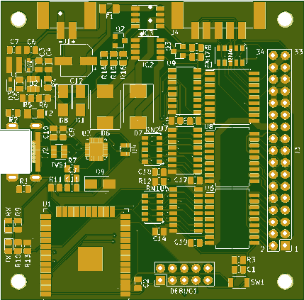
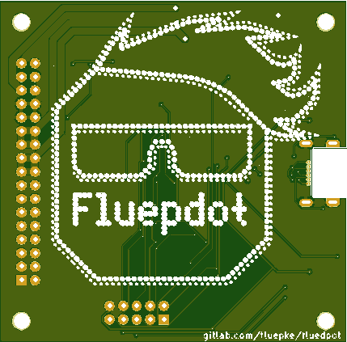

.. Copyright (c) 2020, @fluepke (Fabian Luepke)

  Distributed under the terms of the GNU Affero General Public License version 3.

  The full license is in the file LICENSE, distributed with this software.

Hardware project for controlling legacy flipdot panels used by `BVG`_

Introduction
============

.. note::
   This project was exhibited at `36C3`_. A large display was constructed from many flipdots. `Pictures`_ `of`_ `the`_ `installation`_.

`fluepdot` is a hardware and C project for controlling flip disc panels which where in use by the Berlin public transport operator `BVG`_.

Hardware
--------
Up to 5 flipdot panels are managed by one *fluepboard*.
It is equipped with a dual core **ESP32** that supports **WLAN** and **Bluetooth**.
An **RS485** transceiver can be used for wired installations.
You only have to solder the THT (through hole technology) connectors which are shipped together with the fluepboard as a kit.

+----------+----------+
|     Top  |  Bottom  |
+----------+----------+
|    |top| | |bottom| |
+----------+----------+

Software
--------
The *fluepboard* comes pre-flashed with a firmware, that allows for various ways of interacting with the flipdot.

Features:

- CLI for configuration and testing purposes
- mDNS for simple service discovery
- HTTP API for framebuffer manipulations
- SNMP for monitoring and framebuffer manipulations
- BT LE support for framebuffer manipulations
- C flipdot library for custom applications

.. toctree ::
   :caption: USAGE

   getting_started
   command_line
   snmp
   http_api

.. toctree ::
   :caption: DEVELOPER ZONE
   :maxdepth: 2

   flipdot_library

.. _BVG: https://www.bvg.de/en
.. _36C3: https://events.ccc.de/congress/2019/wiki/index.php/Main_Page
.. _Pictures: https://www.deutschlandfunkkultur.de/chaos-communication-congress-in-leipzig-auf-den-spuren-von.1264.de.html?dram:article_id=466775
.. _of: https://foto.benedikt-geyer.de/fluepdot-36c3/
.. _the: https://www.korrupt.biz/7204/36c3-nachtraege/
.. _installation: https://www.astrastudio.de/cloud/index.php/apps/gallery/s/nDda9j8dZQ2oNMy#IMG_7059.jpeg
